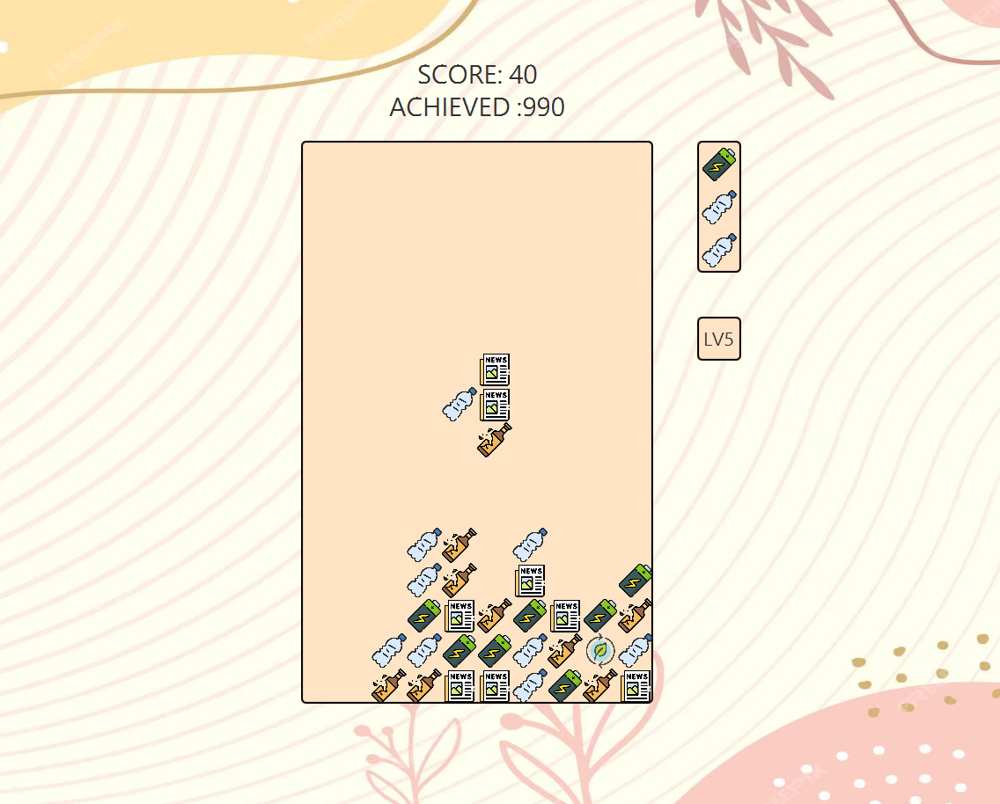

# EcoStack
> EcoStack is a puzzle game with an environmental twist. The player's goal is to manage waste by recycling and composting,
aligning it with ecological themes. It serves a social purpose by raising awareness about recycling and waste management.
> 

[//]: # (> Live demo [_here_]&#40;https://www.example.com&#41;.)

## Table of Contents
* [General Info](#general-information)
* [Built With](#built-with)
* [Screenshots](#screenshots)
* [Setup](#setup)
* [Project Status](#project-status)
* [Contact](#contact)


## General Information

### Core Mechanics:
Instead of colored blocks, you have different types of waste forming up the minos: plastics, glass, paper, organics, etc. 
Each waste type is presented as an image. The play area is a standard grid, simulating a garbage can or a landfill, 
similar to Tetris, where these items fall from the top of the screen.

### Gameplay:
The player must sort the waste into rows (or columns), which then gets recycled. Completing a row(or column) of three 
same type of waste clears it from the board and scores points.
If the player manages to stack several rows of the same type consecutively, they get a combo bonus, 
representing efficient recycling. Special items such as compost activators or recycling boosters occasionally appear 
and can be used to clear all the same type of waste on the board 
when being cleared with those type of waste.
The game gradually speeds up, increasing the difficulty as time goes on.


## Built With
- Java 20
- JavaFX 20
- Maven 20
- JavaFx media 20
- Jackson 20


## Game Guide
- Use &#8592; &#8595; &#8594; to move the waste
- Use &#8593; to rotate the waste
- Use ```Esc``` to pause the game, and then you can choose to restart or resume the game
- The game is ```auto-saved```, you can continue the game after you close the game


## Screenshots



## Setup

This section guides you through getting a copy of the project up and running on your local machine for development and testing purposes.

### Prerequisites

Before you begin, ensure you have the following installed:
- [Git](https://git-scm.com/downloads)
- [Java JDK](https://adoptopenjdk.net/) (version 20 or higher)
- [JavaFX](https://openjfx.io/openjfx-docs/) (version 20 or higher)
- [IntelliJ IDEA](https://www.jetbrains.com/idea/download/)
- [Maven](https://maven.apache.org/download.cgi) (if not included in IntelliJ IDEA)

### Opening the Project in IntelliJ IDEA
1. Launch IntelliJ IDEA.
2. Select ```Open or Import``` on the welcome screen, or choose ```File > Open``` from the main menu if IntelliJ is already open.
Navigate to the directory where you cloned the project, select the root directory of the project, and click ```Open```.
3. IntelliJ IDEA will automatically detect the Maven project and load it accordingly.

### Configuring Maven
1. Once the project is open in IntelliJ, locate the ```pom.xml``` file in the project directory.
2. Right-click on ```pom.xml``` and select ```Add as Maven Project``` if IntelliJ hasn't already recognized it as a Maven project.
3. IntelliJ IDEA should now download all the required dependencies as specified in your ```pom.xml``` file.

### Configuring JavaFX
1. In IntelliJ IDEA, select ```File > Project Structure``` from the main menu.
2. Select ```SDKs``` under ```Platform Settings```.
3. Click the ```+``` button and select ```Java```.
4. Navigate to the directory where you installed JavaFX, select the ```lib``` folder, and click ```OK```.


## Project Status
Project is: _in final testing_ /


## Contact
Created by [Grace Su]() & [Muyang Li]()- feel free to contact us!